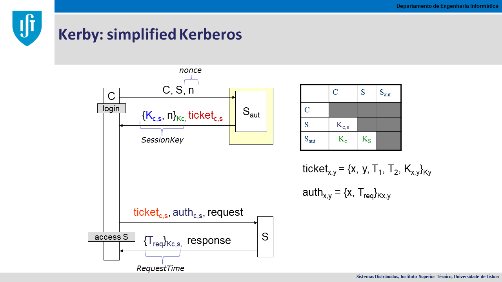

# KerbIST

**Kerb**eros implemented at **I**nstituto **S**uperior **T**écnico, Universidade de Lisboa, Portugal


KerbIST is a simplified version of the 
[Kerberos](http://web.mit.edu/kerberos/) network authentication protocol,
designed to provide strong authentication for client/server applications by using secret-key cryptography. 
A free implementation of the protocol is available from the [Massachusetts Institute of Technology](https://web.mit.edu/).

This implementation, KerbIST, is available from [Instituto Superior Técnico](https://www.tecnico.ulisboa.pt/).
It is used in the Distributed Systems course of the [Degree in Computer Science and Engineering](https://fenix.tecnico.ulisboa.pt/departamentos/dei).

KerbIST is implemented in the Java programming language using the JAX-WS library (Java API for XML Web Services).


## Getting Started

Kerberos is used to _authenticate_ clients and server communicating over an untrusted network using _secret key cryptography_.

To allow the authentication, each client C and server S needs to share a secret key with the authentication server Saut.
For each C, there is a secret key Kc, that is known only by the client and by Saut.
For each S, there is a secret key Ks, that is known only by the server and by Saut.

After the correct protocol execution, a client and a server share a key, Kcs, known only by them and Saut.
Using Kcs it is possible to derive other keys and use them for _message-authentication codes_ and for _message encryption_.


### Protocol summary

The following figure presents the simplified KerbIST protocol.



The simplified version of the Kerberos has only the Saut component.
The TGS (Ticket Granting Service) is not present, as in the full protocol.

The use of _timestamps_ for freshness imply that there must be clock synchronization between all the participants in the system.

### Modules

KerbIST is composed of 4 modules:
* kerby-contract - interface description exported in WSDL format
* kerby-ws - authentication and ticket issuing web service
* kerby-ws-cli - authentication client
* kerby-lib - application library to issue and use tickets and other data structures


### Prerequisites

KerbIST requires Java Developer Kit 8 running on Linux, Windows or Mac.
Maven 3 is also required.

To confirm that you have it installed, open a terminal and type:

```
javac -version

mvn -version
```

### Installing

To compile and install all modules:

```
mvn clean install -DskipTests
```

The tests are skipped because they require the server to be running.

To generate a combined javadoc:

```
mvn javadoc:aggregate -pl :kerby,:kerby-lib,:kerby-ws-cli
```

The javadoc aggregates classes from the mentioned modules.

To start the server:

```
cd kerby-ws
mvn exec:java
```


## Deployment

To deploy a KerbIST server, the program should be started with a URL containing a public DNS name or IP address instead of the default 'localhost' used for development.


## Built With

* [Maven](https://maven.apache.org/) - Build Tool and Dependency Management
* [JAX-WS](https://javaee.github.io/metro-jax-ws/) - SOAP Web Services implementation for Java

<!--
## Contributing

Please read [CONTRIBUTING.md](https://gist.github.com/PurpleBooth/b24679402957c63ec426) for details on our code of conduct, and the process for submitting pull requests to us.
-->

## Versioning

We use [SemVer](http://semver.org/) for versioning. 
<!--
For the versions available, see the [tags on this repository](https://github.com/your/project/tags). 
-->

## Authors

* **Miguel L. Pardal** - *Initial work* - [miguelpardal](https://github.com/miguelpardal)
* **Guilherme Ilunga** - *server implementation* - [GIlunga](https://github.com/GIlunga)
* **Miguel Amaral** - *handler library* - [miguel-amarall](https://github.com/miguel-amaral)

See also the list of [contributors](https://github.com/tecnico-distsys/kerbist/contributors) who participated in this project.

## License

This project is licensed under the MIT License - see the [LICENSE.md](LICENSE.md) file for details

## Acknowledgments

* All the Distributed Systems students for their feedback
* Other members of the Distributed Systems teaching staff

